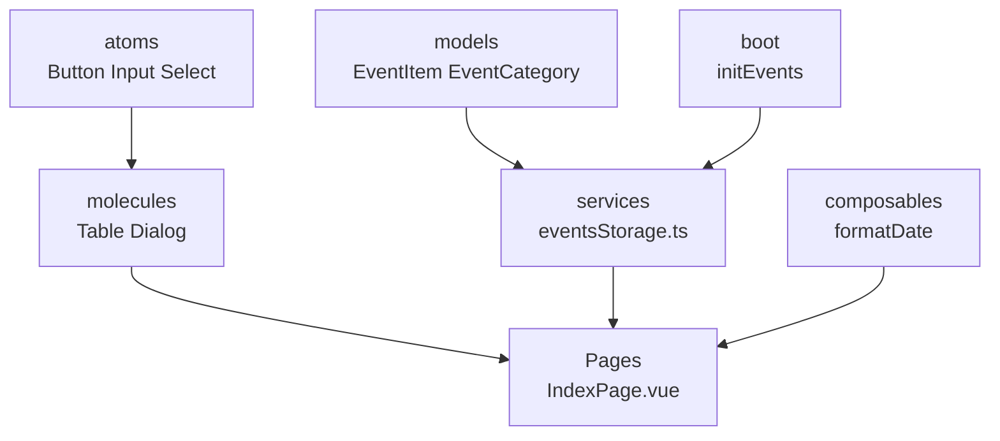

# NTS Events Manager

 

  
  
  
  
  

## 🚀 Описание

**Современный дашборд для управления событиями** на **Quasar + Vue 3 + TypeScript + Tailwind CSS**.

**Полностью responsive** CRUD с фильтрацией, поиском, валидацией и локальным хранением данных.

## ✨ Основные возможности

| ✅ **CRUD**          | ✅ **Фильтры**         | ✅ **Валидация** | ✅ **Responsive** |
| -------------------- | ---------------------- | ---------------- | ----------------- |
| Create/Update/Delete | Category/Status/Search | Title/Date       | 📱💻📱            |
| **Atomic Design**    | **localStorage**       | **TypeScript**   | **Tailwind CSS**  |

## 🏗️ Архитектура (Atomic Design)

